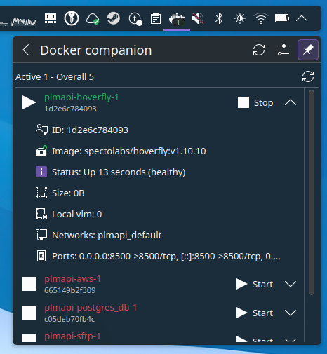

  

<h1 align="center">Docker companion <i>- a plasma widget</i></h1>

---

# Description

---

A lightweight Docker companion that detects service launches and displays container details.

Features:
- Monitors Docker service status
- Shows counts of running and total containers
- Provides detailed information about each container
- Allows starting and stopping containers
- Refreshes automatically at configurable intervals

# Installation

---

### Via the KDE menu

You can install the widget from:
- the KDE menu `Get New Widgets...`

### Manual installation
#### Plasma 6
- download via [the KDE store](https://www.pling.com/p/2309112/) (install in `~/.local/share/plasma/plasmoids/`)
- or via the github release section
- place the `a2n.docker.plasmoid` folder in `~/.local/share/plasma/plasmoids/`

#### Dependencies
You need to have the following packages installed on your system:
- `docker` - The Docker service and CLI

## How to have this in my system tray?
Go to the 'System Tray Settings' menu and activate it :)

*in some case you may need to log out / log in to see it in the list*

# Configuration

---

The plasmoid offers several configuration options to customize its behavior and appearance:

| Name                   | Description                                                                                       | Result                                                                                 |
|------------------------|---------------------------------------------------------------------------------------------------|----------------------------------------------------------------------------------------|
| Command & Debug        |                                                                                                   |                                                                                        |
| Interval configuration | Set the interval between each execution of the update check function (in seconds)                 | The Docker status is checked each X seconds                                             |
| Check Active Command   | The command used to check if Docker service is active                                             | Default: `systemctl is-active docker`                                                  |
| Count Active Command   | The command used to count running containers                                                      | Default: `docker ps -q \| wc -l`                                                       |
| Count All Command      | The command used to count all containers (including stopped ones)                                 | Default: `docker ps -qa \| wc -l`                                                      |
| List Command           | The command used to list all containers                                                           | Default: `docker ps --format json -a`                                                  |
| Display                |                                                                                                   |                                                                                        |
| Separate Result        | If you want to show both active and total containers in the label                                 | Sets the label text to `active~total` using the configured separator                   |
| Separator              | The text you want to use as separator between active and total counts                             | Default: `~`                                                                           |
| Show a dot             | Replace the label with a colored dot                                                              | If active containers > 0, the dot is visible; otherwise nothing is shown               |
| Custom dot color       | If you want to customize the color of the dot                                                     | If not checked, the dot gets the color from your theme                                 |
| Custom dot position    | If you want to customize the position of the dot                                                  | Options: Top Right, Top Left, Bottom Right, Bottom Left                                |
| Icon color             | If you want to customize the color of the icon                                                    | If not checked, the icon gets the color from your theme                                |

# Code of conduct, license, authors, changelog, contributing

---

See the following file:
- [code of conduct](CODE_OF_CONDUCT.md)
- [license](LICENSE)
- [authors](AUTHORS)
- [contributing](CONTRIBUTING.md)
- [changelog](CHANGELOG)
- [security](SECURITY.md)

# Want to participate? Have a bug or a request feature?

---

Do not hesitate to open a PR or an issue. I reply when I can.

# Want to support my work?

---

- [Give me a tips](https://ko-fi.com/a2n00)
- [Give a star on github](https://github.com/bouteillerAlan/dockercompanion)
- [Add a rating and a comment on Pling](https://www.pling.com/p/)
- [Become a fan on Pling](https://www.pling.com/p/)
- Or just participate to the development :D

### Thanks!
